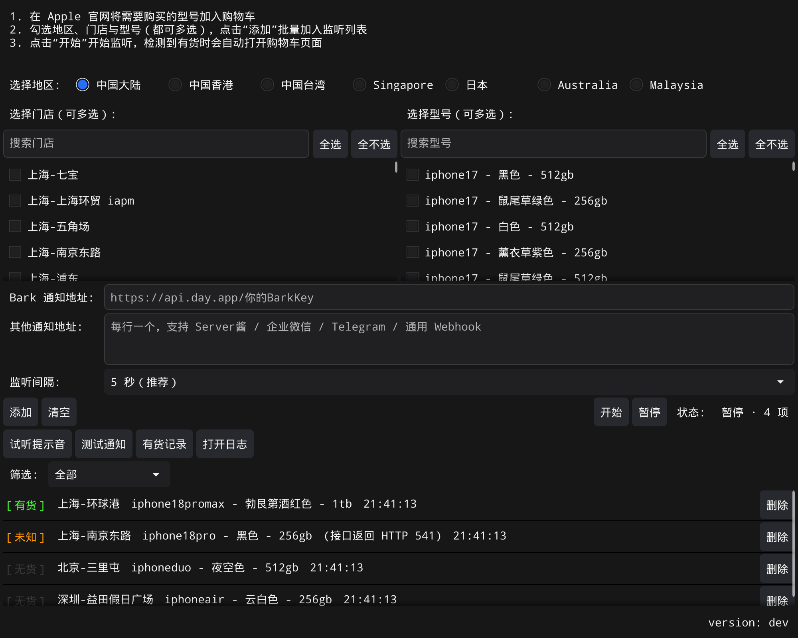

# Apple Store 预约助手

## 支持 iPhone 18 Pro / Pro Max、iPhone Duo、iPhone Air、iPhone 17 / 17e



## 重要提示
* *这不是外挂，不能全自动一劳永逸*
* *提前登录*
* *提前将需要购买的型号加入购物车，检测有货会打开购物车页面，需要在购物车页面手动选择门店*

## 下载
前往 [release](https://github.com/dashug/apple-store-helper/releases/latest) 页面，
按用途选择：

| 用途 | 下载 |
| --- | --- |
| macOS 图形版 | `Apple-Store-Helper-*-macos-universal.zip`（Intel 与 Apple Silicon 通用） |
| Windows 图形版 | `Apple-Store-Helper-*-windows-amd64.zip`，32 位系统用 `-386` |
| 服务器长期运行 | `apple-store-cli-*-linux-amd64.zip`（静态二进制，约 3 MB，无需桌面环境） |
| 其他平台的命令行版 | `apple-store-cli-*` 中对应 `linux-arm64` / `darwin-*` / `windows-amd64` 的包 |

macOS 首次打开若被拦下（安装包做了 ad-hoc 签名，但下载会带隔离属性）：

```shell script
xattr -cr "Apple Store Helper.app"
```

各版本的具体变更见 release 页面对应 tag 的说明。

## 关于开发
* 代码不优雅, 注释不完善, review须谨慎
* GUI框架 [fyne](https://github.com/fyne-io/fyne)

### 更新界面截图
README 顶部的截图由测试生成，不需要手动截屏：

```shell script
GEN_SCREENSHOT=1 go test -run TestGenerateScreenshot .
```

它渲染的就是 `buildUI` 组装的真实界面，界面改了重跑一次即可。

### 更新图标
`Icon.svg` 是图标源文件，`Icon.png` 由它生成：

```shell script
rsvg-convert -w 1024 -h 1024 Icon.svg -o Icon.png
```

打包与托盘都使用 `Icon.png`。改动后建议在 16px 下确认仍可辨认 —— 托盘图标
只有这么大，细节在这个尺寸会全部消失。

### 更新机型数据
新机型发布后，`config/files/products_*.json` 需要重新抓取：

```shell script
python3 scripts/fetch_products.py             # 全部地区
python3 scripts/fetch_products.py --dry-run   # 只看结果，不写文件
```

数据源是各地区购买页内嵌的 `productSelectionData`。若购买页地址有变动，
修改脚本顶部的 `SLUGS` 即可。

检查是否出现了尚未收录的新机型：

```shell script
python3 scripts/fetch_products.py --check-new
```

它会扫描各地区的 `/shop/buy-iphone` 索引页，并逐个验证候选页面确实是有效
购买页（索引页会残留已下架机型的链接）。确认要监控的加进 `SLUGS`，确认不
需要的加进 `IGNORED_SLUGS`。

### 更新门店数据
门店会开设与关闭，这份数据同样需要更新：

```shell script
python3 scripts/fetch_stores.py             # 写入文件
python3 scripts/fetch_stores.py --dry-run   # 只看增减，不写文件
```

数据源是零售店列表页 Next.js 数据中的 `props.pageProps.storeList`，一次请求即可
拿到全部地区。注意脚本固定使用 `apple.com.cn` 入口：入口域名决定港澳地区返回的
语言变体，`apple.com` 给的是 `en_HK`，本项目需要的 `zh_HK` 只有 `.cn` 入口才有。

以上几件事每天由 [`update-data.yml`](.github/workflows/update-data.yml)
自动执行：数据有变化或发现未收录机型时会自动提交 PR，等待人工确认后合并。

### 运行
```shell script
go run main.go
```

### 打包

#### 快速打包（推荐）
```shell script
# 使用打包脚本（自动处理签名问题）
./build.sh
```

#### 手动打包
```shell script
# Mac OS 环境下打包
# fyne CLI 已迁移，旧路径 fyne.io/fyne/v2/cmd/fyne 官方标记为 deprecated
go install fyne.io/tools/cmd/fyne@latest
go install github.com/fyne-io/fyne-cross@latest

# 基础打包命令
fyne-cross darwin -arch=amd64,arm64 -app-id=apple.store.helper -name="Apple Store Helper"
fyne-cross windows -arch=amd64,386 -app-id=apple.store.helper -name="Apple Store Helper"

# macOS ARM64 版本需要额外处理签名
xattr -cr "fyne-cross/dist/darwin-arm64/Apple Store Helper.app"
codesign --force --deep --sign - "fyne-cross/dist/darwin-arm64/Apple Store Helper.app"
```

如果提示 `fyne-cross: command not found`，请配置 GO 环境变量  
添加以下内容到 `~/.zshrc` 或 `~/.bashrc` 中
```shell script
# GOLANG
export GOROOT=/usr/local/go
export GOPATH=$HOME/go
export PATH=$PATH:$GOPATH/bin
```
GOROOT 为 GO 安装目录，根据实际安装位置修改

## 命令行版
`apple-store-cli` 不依赖图形环境，可以在服务器上长期挂着；命中有货时通过
配置的通知渠道提醒。静态编译，丢进任何 Linux 机器都能直接跑，不需要安装
`libGL` / `libX11`。

```shell script
# 先看有哪些地区、门店与型号
apple-store-cli --list-areas
apple-store-cli --area 中国大陆 --list-stores
apple-store-cli --area 中国大陆 --list-products

# 盯上海两家店的一个型号，命中时推送到 Bark
apple-store-cli --area 中国大陆 \
  --store 上海-环球港 --store 上海-南京东路 \
  --product "iphone18pro - 黑色 - 256gb" \
  --notify https://api.day.app/你的BarkKey

# 只查一轮就退出，便于配合 cron
apple-store-cli --area 中国大陆 --store 上海-环球港 \
  --product "iphone18pro - 黑色 - 256gb" --once
```

不指定 `--store` / `--product` 时会读取配置文件，因此在图形版里配好之后，
把配置文件拷到服务器即可直接运行。

下载见上面的[下载](#下载)一节。

## 使用方法

1. 按上面[下载](#下载)一节取得对应平台的程序并启动
2. 在 Apple 官网将需要购买的型号加入购物车
3. 选择地区、门店和型号，点击`添加`按钮，将需要监听的型号添加到监听列表
4. 点击`开始`按钮开始监听，检测到有货时会自动打开购物车页面
5. 匹配到有货后会自动暂停监听，直到再次点击 `开始`

### 查看与操作
* 监听列表上方可按状态`筛选`（全部 / 有货 / 未知 / 无货 / 等待），只影响显示，
  不影响监听范围；筛掉部分时会标出「N / M 项」
* 状态栏显示`状态 · 项数 · 上轮完成时间`，可据此确认程序仍在正常轮转
* 窗口尺寸会被记住，下次启动恢复
* 点`添加`后会清空门店与型号的勾选，避免不确定那些勾还算不算数
* 每行可`停用`：暂时不查询该项但保留配置，随时可`启用`。停用项显示为
  `已停用`并排在列表最后，状态栏会标出停用数量

### 多地区
各地区的监听列表分开保存。切换地区只是切换显示与监听的范围，另一个地区
已配置的门店与型号会原样保留，切回去即可恢复。`清空`按钮也只清当前地区。

### 有货记录
每次检测到有货都会记进配置目录下的 `history.jsonl`，界面上的`有货记录`
按钮可以查看：按时间倒序列出门店与型号，并按命中次数给出门店排行。

盯十几家门店时，真正需要的判断是「该重点盯哪几家」，而这个判断只能靠
历史命中情况。保留最近 500 条。

### 日志
运行日志写在配置文件同一目录下的 `app.log`：

* macOS: `~/Library/Application Support/apple-store-helper/`
* Windows: `%AppData%\apple-store-helper\`

界面上的`打开日志`按钮会直接打开该目录。查询失败的原因、推送失败、
配置保存失败都会记在里面 —— 反馈问题时附上这个文件会有帮助。
超过 2 MiB 会轮转一次，保留一份历史（`app.log.1`）。

### 关于托盘
关闭窗口不会退出程序，只是收进系统托盘，后台继续监听 —— 发售前挂几个小时
不必一直开着窗口。点击托盘图标可重新打开窗口，托盘菜单里也能直接开始/暂停。
**完全退出请用托盘菜单中的「退出」。** 检测到有货时窗口会自动弹回前台。

### 关于监听间隔
默认 5 秒。间隔越短越早发现有货，但请求越密也越容易被 Apple 限流 ——
被限流时所有型号会显示`未知`，恰好在最需要结果的时刻拿不到结果。
连续查询失败时程序会自动退避，恢复正常后立即回到设定的间隔。

### 通知渠道
除 Bark 外，`其他通知地址`支持每行填一个地址，按地址自动识别渠道：

| 渠道 | 地址形式 |
| --- | --- |
| Server酱 | `https://sctapi.ftqq.com/<KEY>.send` |
| 企业微信群机器人 | `https://qyapi.weixin.qq.com/cgi-bin/webhook/send?key=<KEY>` |
| Telegram | `https://api.telegram.org/bot<TOKEN>/sendMessage?chat_id=<ID>` |
| 通用 Webhook | 其余地址，POST 一个含 `title` / `content` / `url` 的 JSON |

以 `#` 开头的行会被忽略，可用来做备注。

`Bark 通知地址`保持独立字段：Bark 支持自建，自建地址的域名不是 `day.app`，
放进自动识别会被误判成通用 Webhook。

点`测试通知`会向所有已配置的地址各发一条，并逐条显示成功或失败原因。

### 有货时推送通知到 iOS 设备
1. App Store 下载并安装 App 「Bark」，并允许「Bark」进行推送
2. 打开「Bark」，复制应用中代表你自己设备的地址（格式如` https://api.day.app/xxxxxxxxx `），粘贴至本应用的`Bark 通知地址`栏
3. 点击 `测试 Bark 通知`，确认应用能够通知到你的 iOS 设备
4. 更多内容请参考 `https://bark.day.app/`

## Contributors
- [@Hteen](https://github.com/hteen)
- [@Timssse](https://github.com/Timssse)
- [@Black-Hole](https://github.com/BlackHole1)
- [@RayJason](https://github.com/RayJason)
- [@Warkeeper](https://github.com/Warkeeper)

